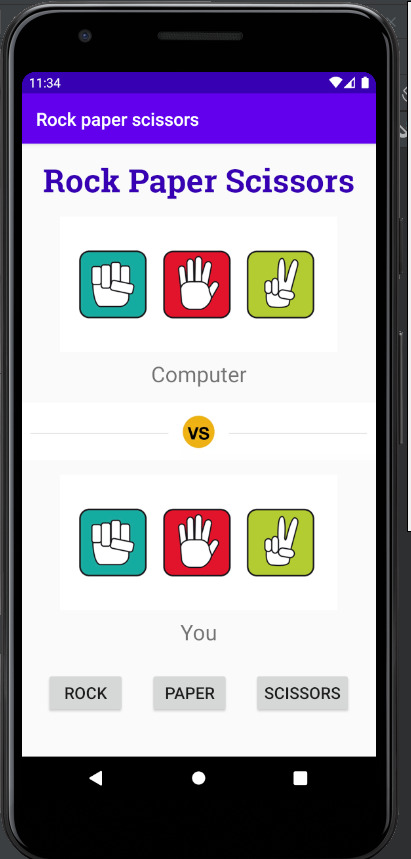

# 100 Days Of Code - Log

### Day 1: August 1, Saturday

**Today's Progress**: I participated in two coding contests today and secured rank: 471 in first contest and in the second contest which was 1v1 I secured a victory.

**Thoughts** I've recently started coding, and it's a great feeling when I finally solve an algorithm challenge after a lot of attempts and hours spent.

**More Info**
1. First contest: All India Contest by Mission Helix | 1 August
2. Second contest: HackerEarth | CodeArena

### Day 2: August 2, Sunday

**Today's Progress**: I started working on an android app named - "About me" using kotlin.

**Thoughts**: I am learning android development since the last week and this is my first app made by myself i.e. no code along project.

### Day 3: August 3, Monday

**Today's Progress**: Learned a lot about views in android and started coding in XML for writing those views.

**Thoughts**: Initially I was using the drag and drop feature of the android studio but now I started coding the code rather than drag and drop.

### Day 5: August 5, Wednesday

**Today's Progress**: Finally finished my "About me" android app and also started front-end development.

**Thoughts**: Today I completed the "about me" app by making the app more efficient by adding data classes and binding views.

### Day 6: August 6, Thursday

**Today's Progress**: Completed the HTML part if the front-end development and started CSS.

**Thoughts**: I completed the really interactive course of HTML at freecodecamp and then started CSS.

### Day 7: August 7, Friday

**Today's Progress**: Completed the "Scientific Computing with pyhton" course in freecodecamp and got a certificate for that.

**Thoughts**: The 5 projects for the final task of the course were really difficult but somehow I managed to solve them all.

**More Info**
    

### Day 8: August 8, Saturday

**Today's Progress**: Solved 3 questions from the codechef august long challenge and I am currently rank 4324 globally.

**Thoughts**: Very long and tiring day.

### Day 9-10: August 9-10, Sunday-Monday

**Today's Progress**: Completed the front-end development course at udemy and started creating a "Rock paper scissors" app game.

**Thoughts**: Due to python - flask course i was not able to concentrate more on coding.

### Day 11-12: August 11-12, Tuesday-Wednesday

**Today's Progress**: Completed my "Rock paper scissors" app.

**Thoughts**: This app was my first major android app which was not a code along project.

**More Info**
    

### Day 13: August 13, Thursday

**Today's Progress**: Started working on a Calculator android app.

**Thoughts**: Working with this app taught me how to work with more than 1 button.
